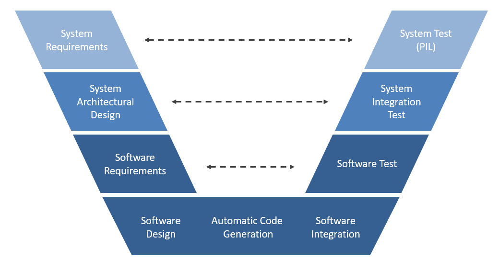

# road-sign-recognition
The aim of the project is to build and train a Neural Network for road sign classification and 
deploy it on Raspberry Pi.
## Model Based Design
For the realization of the project we followed a V-Model development cycle as presented below.

- System Requirements: general definition of the system behavior
- System Architectural Design: definition of software modules for training and validation, deployment and test
- Software Requirements: definition of input and output values as well as standard library dependencies
- Software Design: software modules implementation on MATLAB
- Automatic Code Generation: C++ code generation with the MATLAB Coder
- Software Integration: integration of the auto-generated code with MATLAB scripts
- Software Test: preliminary software tests run in MATLAB on PC
- System Integration Test: verify correctness of the generation and deployment of code on Raspberry
- System Test (PIL): final processor in the loop tests

## Getting Started
These instructions explain how to set up the tools needed to execute the steps described in the next sections. 
### Prerequisites
In order to reproduce the examples the following tools are needed:
- Raspberry Pi (tested on Model 2B and 3B)
- MATLAB Deep Learning Toolbox
- MATLAB Coder
- Embedded Coder
- MATLAB Support Package for Raspberry Pi Hardware
- MATLAB Coder Interface for Deep Learning Libraries
- [German Traffic Sign Recognition Benchmark (GTSRB) Dataset](http://benchmark.ini.rub.de/?section=gtsrb&subsection=dataset)
### Installing
Install MATLAB and all the packages specified in the prerequisites section.
For the deployment on the Raspberry the Raspbian Mathworks image should be installed as well as the ARM Compute library (tested with version 19.02) and opencv (tested with version 3.1.0) libraries.

## Neural Network Configuration
In this section are described the instructions for the training and testing of the Convolutional Neural Network (mResNet). The files and scripts needed for this section can be found in the [mResNetCNNConfiguration](https://github.com/meltinglab/road-sign-recognition/blob/master/mResNetCNNConfiguration) folder.
### mResNet
The [mResNet.mlx](https://github.com/meltinglab/road-sign-recognition/blob/master/mResNetCNNConfiguration/mResNet.mlx) contains the live script of the Convolutional Neural Network mResNet created with the Deep Network Designer tool from the Deep Learning Toolbox. 
### Network Training
In order to train the Network for traffic sign recognition, the script [TrainingMain.m](https://github.com/meltinglab/road-sign-recognition/blob/master/mResNetCNNConfiguration/TrainingMain.m) must be executed. The script calls the [DatasetReading.m](https://github.com/meltinglab/road-sign-recognition/blob/master/mResNetCNNConfiguration/DatasetReading.m) and [NetworkTraining.m](https://github.com/meltinglab/road-sign-recognition/blob/master/mResNetCNNConfiguration/NetworkTraining.m) function returning the trained mResNet.
### Network Testing
In order to test the correct behavior of the trained network, the [NetworkTest.m](https://github.com/meltinglab/road-sign-recognition/blob/master/mResNetCNNConfiguration/NetworkTest.m) script must be executed which returns the classification accuracy of the network. If the previous steps were executed correctly, the classification accuracy should be about 0.98.
## Raspberry Deployment
In this section the steps for the deployment of the trained network on the target hardware are described. The files and scripts needed for this section can be found in the [RaspberryDeployment](https://github.com/meltinglab/road-sign-recognition/blob/master/RaspberryDeployment) folder.
### Code Generation
In order to automatically generate the C++ code for the Raspberry Pi, the script [TestCodeGenerator.m](https://github.com/meltinglab/road-sign-recognition/blob/master/RaspberryDeployment/TestCodeGenerator.m) must be executed. This script defines the options for the MATLAB Coder and generates and .elf package from the [mResNet_classify.m](https://github.com/meltinglab/road-sign-recognition/blob/master/RaspberryDeployment/mResNet_classify.m) and [Postprocess.m](https://github.com/meltinglab/road-sign-recognition/blob/master/RaspberryDeployment/Postprocess.m) functions on the target hardware. These functions use the pretrained mResNet provided in the [trained_net.mat](https://github.com/meltinglab/road-sign-recognition/blob/master/RaspberryDeployment/trained_net.mat) file.
### Processor in the Loop
The execution of [TestCodeGenerator.m](https://github.com/meltinglab/road-sign-recognition/blob/master/RaspberryDeployment/TestCodeGenerator.m) sets the ```VerificationMode``` field of the Embedded Coder to PIL. This activates the processor in the loop mode which can be exploited with the script [PILRaspberryTest.m](https://github.com/meltinglab/road-sign-recognition/blob/master/RaspberryDeployment/PILRaspberryTest.m) in order to test the network on the Raspberry. This script uses the five sample images provided in the folder [TestImages](https://github.com/meltinglab/road-sign-recognition/tree/master/TestImages).
## Documentation
To obtain further information refer to the autogenerated html documentation provided in the [Documentation](https://github.com/meltinglab/road-sign-recognition/tree/master/Documentation) folder. The documentation can be accessed from the [index.html](https://github.com/meltinglab/road-sign-recognition/blob/master/Documentation/index.html) file.

## Authors
- Filippo Cenonfolo
- Matteo Lenti
- Damiano Vandi
